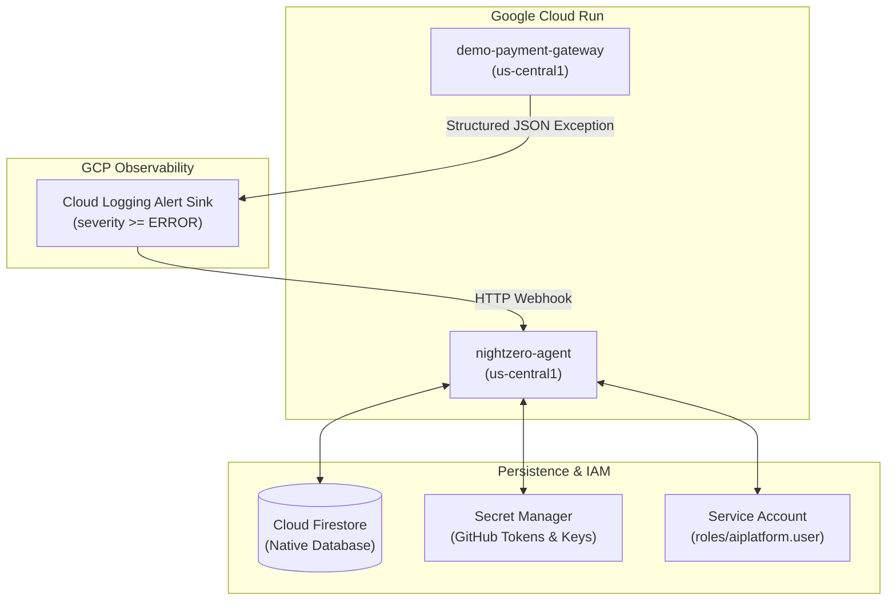

# NightZero Infrastructure 🌌
### Cloud Provisioning, Logging Sinks, and IAM Automation

[](https://cloud.google.com)
[](https://cloud.google.com/firestore)
[](LICENSE)

---

## 📌 Overview

This repository contains deployment automation, GCP service configurations, and scripts for provisioning the production NightZero ecosystem on Google Cloud Platform.

---

## 🏛️ GCP Infrastructure Blueprint



---

## 🛠️ Automated Setup Scripts

### 1. `deploy_gcloud.sh`
Automates deployment of the `nightzero-agent` service to Google Cloud Run with Vertex AI configuration:
```bash
./scripts/deploy_gcloud.sh
```

### 2. `setup_test_project_e2e.sh`
Sets up the end-to-end telemetry sink and Cloud Run deployment for `demo-payment-gateway`:
```bash
./scripts/setup_test_project_e2e.sh
```

---

## 📜 License
Licensed under the [Apache License 2.0](LICENSE).
